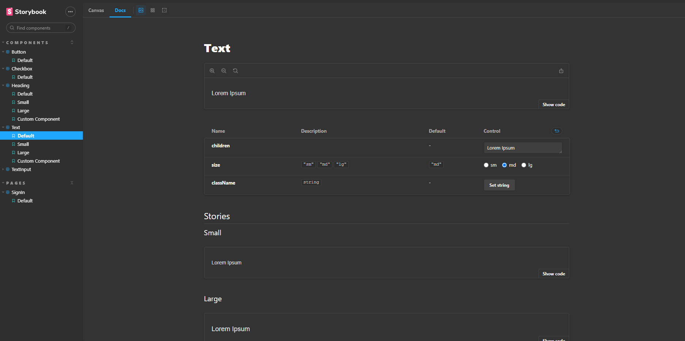

# Weather APP

> This application was made during rocketseat's ignite lab, where the intention was to create a design system documented in the storybook, starting from 0 in the figma until having the whole system documented, developed with tests and creation of a CI/CD pipeline.

## Technologies used

This project was developed with the following technologies:

- [Node 16.17](https://nodejs.org/en/)
- [React 18.2](https://reactjs.org/)
- [TypeScript 4.6.4](https://www.typescriptlang.org/)
- [Vite](https://vitejs.dev/)
- [Radix-UI](https://www.radix-ui.com/)
- [Phosphor-Icons](https://phosphoricons.com/)
- [Tailwind CSS](https://tailwindcss.com/)
- [storybook](https://storybook.js.org/)
- [Axios](https://github.com/axios/axios)
- [Jest](https://jestjs.io/)
- [Testing-library](https://testing-library.com/docs/react-testing-library/intro/)
- [Mock Service Worker](https://mswjs.io/)

## 💻 Prerequisites

Before you begin, check that you have met the following requirements:

- You have installed the latest version of `<nodeJs>`
- You have a machine `<Windows / Linux / Mac>`.
- You read `<documentation>`.

## 📝 To run the project:

- Clone the project by running this command in the terminal `git clone <repo_url>`;
- First we have to:
  - Clone the project by running this command in the terminal `git clone <repo_url>`;
  - Open the project folder and duplicate the .env.example file and rename the copy to .env;
- Open the project folder in the terminal and run:
  - `yarn` or `npm install` -> To install all dependencies;
  - `yarn dev` or `npm run dev` -> To run the project;
  - `yarn storybook` or `npm run storybook` -> To run the storybook;
- To run the tests just run `yarn test` or `npm run test`.
